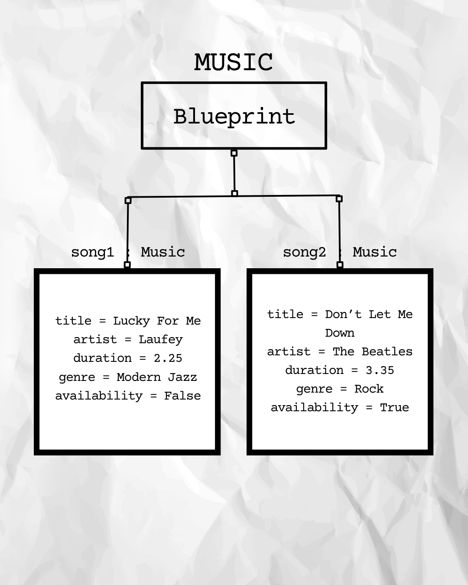

# Class Attributes and Methods

## Previous Design
Link to my previous activity:
[classObjectUML.md](https://github.com/fdcbarrio-spec/9berylliumcs3/blob/main/q1/classObjectUML.md)

## Design Revision
- Changed the **availability** attribute into a private attribute to protect its value from being directly modified outside the class
- Kept the original properties and methods from my previous design
- Added methods that allow the private **availability** attribute to be safely accessed and modified

## Visibility Decisions

| Attribute | Data Type | Visibility | Reason |
|---|---|---|---|
| + title | string | Public | The title identifies the song and can be displayed and accessed normally. |
| + artist | string | Public | The artist's name can be accessed and displayed normally. |
| + genre | string | Public | The genre is general information that can be normally accessed. |
| + duration | float | Public | The duration can be viewed by users without needing protection. |
| + availability | boolean | Public | Its value should be controlled to prevent other parts of the program from changing it directly. |

## Updated UML Class Diagram

## Python Implementation

[View Python Source](classImplementation.py)

## Test Run
.png)
.png)

## Object Diagram

## Analysis

### Why did you make your chosen attribute private?

I made the **availability** attribute private so it cannot be directly changed by other parts of the program. If it could be changed freely, the availability status might be changed accidentally or incorrectly. Using methods to access or modify it gives the program more control over how its value is changed.

### Which method changes the state of your object?

The changeAvailability() method changes the state of a Music object. It changes the value of the private __availability attribute based on the status provided as a parameter. In the test run, this method changes the availability of song1 from True to False.

### How did your two objects demonstrate that instances are independent?

The two objects demonstrated independence because changing song1 did not change song2. After calling changeAvailability(False) on song1, its availability became False. However, song2 remained available with a value of True, showing that each object has its own separate state.

### What is the difference between your class diagram and your object diagram?

The class diagram shows the blueprint of the Music class, including its attributes, data types, and methods. It describes what every Music object can have and do. Meanwhile, the object diagram shows the actual objects created from the class and their specific values after the program was executed.