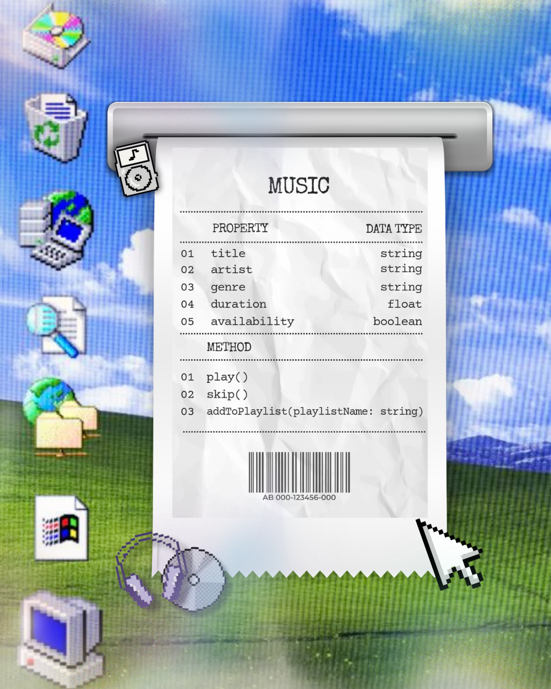

# SG4 - Understanding Classes and Objects
## Class Name: Music
## Class Description
The **Music** class represents a song in a music system. It stores information about a song and provides actions that allow the user to interact with it.
## Properties
| Property | Data Type | Description |
|---|---|---|
| title | string | The song's title |
| artist | string | The creator or the performer of the song |
| genre | string | The type or style of music the song is categorized (e.g. Classical, Jazz, R&B, etc.) |
| duration | float | The length of the song in minutes |
| availability | boolean | Whether the physical copy of the song (e.g. vinyl records, CDs, etc.) is available |

## Methods
| Method | Description |
|---|---|
| play() | Plays or starts the song |
| skip() | Skips the current song and plays another one |
| addToPlaylist(playlistName: string) | Adds the song to the user's desired playlist |

## Class Diagram

## Design Explanation
### Why did you choose this class?

I chose the class **Music** simply because I love music. Music is something I enjoy and integrate into my everyday life; my extracurriculars, hobbies, interests, and everything in between all mostly revolve around music, so I wanted to design a class based on something I am most definitely familiar with.

### Which property is the most important? Why?

In my opinion, the most important property is the **title**, because it serves as the most basic piece information about the song. Without it, we wouldn't be able to differentiate songs from one another.

### Which method is the most useful? Why?

For me, the most useful method is **play()**, because it allows the user to actually listen to the song. It is the main action of the **Music** class and is necessary for the song to serve its main purpose. Without it, all the other methods would not function. However, if I were to be asked which method is the most interesting, I would say the **addToPlaylist(playlistName: string)** method because it allows the user to organize songs into different playlists. Personally, I often organize songs in various playlists so I can have a playlist to listen to for every mood or occasion.